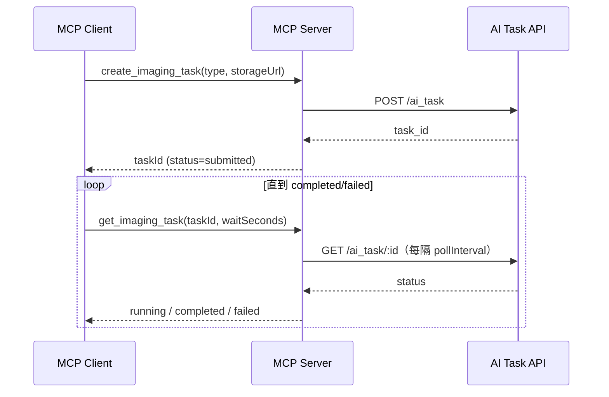

# MCP 工具详情

本文档供 Agent 在需要了解工具字段、返回结构、长轮询策略时按需加载。

## create_imaging_task

提交 DICOM 7z URL 到 AI Task API，立即返回，不等待 AI 计算。

输入：

```json
{
  "type": "ich",
  "storageUrl": "http://10.5.178.21:8001/ich/example.7z"
}
```

| 字段 | 必填 | 说明 |
| --- | --- | --- |
| `type` | 是 | 检测类型。ICH 固定为 `ich`。 |
| `storageUrl` | 是 | 完整可下载的 DICOM 7z URL。AI Task API 必须能访问。不要用 `localhost` 或 `127.0.0.1`。 |

结构化输出：

```json
{
  "type": "ich",
  "label": "CT_BRAIN",
  "taskId": "a1b2c3d4",
  "status": "submitted"
}
```

成功后保存返回的 `taskId`，用于后续所有查询。

## get_imaging_task

按 `taskId` 查询已有任务。`taskId` 全局唯一，查询时不需要传 `type`。

输入：

```json
{
  "taskId": "a1b2c3d4",
  "waitSeconds": 60
}
```

| 字段 | 必填 | 说明 |
| --- | --- | --- |
| `taskId` | 是 | `create_imaging_task` 返回的任务 ID。 |
| `waitSeconds` | 否 | 服务端有界长轮询预算。`0` 表示单次查询。省略使用服务端默认 `AI_TASK_DEFAULT_WAIT_MS`（当前 `0`）。超过 `AI_TASK_MAX_WAIT_MS`（默认 120 秒）会被截断。推荐 `30`~`60`。 |

按状态返回：

- `running`：仍在计算。用同一 `taskId` 再次调用 `get_imaging_task`，通常 `waitSeconds: 30`~`60`。
- `failed`：计算失败。展示 `message` 并停止，除非用户要求重试。
- `completed`：报告就绪，包含 `type`、`label`、`report.findings`、`report.conclusions`、`report.emergencies`、`viewUrl`。

不要高频轮询。优先少量 `waitSeconds: 30`~`60` 的调用，直到 `completed` 或 `failed`。

## 有界长轮询

`get_imaging_task` 至少查询一次；若仍为 `running`，按 `AI_TASK_POLL_INTERVAL_MS` 间隔在服务端继续查询，直到任务结束或 `waitSeconds` 预算耗尽再返回。少量 `waitSeconds=30~60` 的调用即可替代大量高频空轮询。



## AI Task API 交互与状态映射

- 提交：`POST {AI_TASK_API_BASE}/ai_task`，请求体 `{ "url": storageUrl }`，响应含 `task_id`。
- 查询：`GET {AI_TASK_API_BASE}/ai_task/{taskId}`。
- 数值状态映射：`4`→`completed`，`3`→`failed`，其余→`running`。

## 检测类型映射

| MCP `type` | AI Task label | 说明 |
| --- | --- | --- |
| `ich` | `CT_BRAIN` | 卒中 / 脑出血影像分析 |

查询结果时按算法 label 反查 `type`，因此 `get_imaging_task` 无需再传 `type`。

## 结果解析

从 `ai_result[label]`（或其 `.data` 容器）读取 `seriesList`，聚合并去重：

- `findings`：各 series 的 `imageFindings`。
- `conclusions`：各 series 的 `conclusion`。
- `emergencies`：`emergency[].hasEmergency` 为真的项，剥离 HTML 标签。
- `viewUrl`：查看地址。
